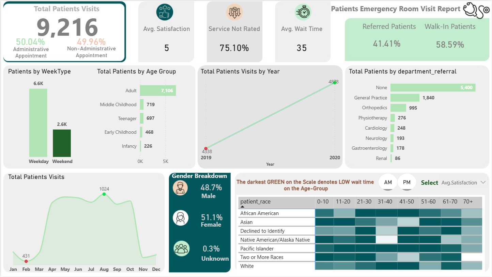

# Patient Emergency Room Visit Analysis (Power BI)

## 📌 Project Overview
This project analyzes **9,200+ hospital emergency room visits** to uncover trends in patient demographics, appointment types, referrals, and satisfaction levels.  
The goal is to help hospital administrators optimize **patient flow, staffing, and operational efficiency** through interactive dashboards.

## 🛠️ Tools & Technologies
- Power BI (Data Visualization & Dashboarding)
- DAX (KPI Calculations)
- Excel / CSV (Dataset)

## 📊 Key Features
- KPIs: Average Wait Time, Satisfaction Score, Yearly Visit Trends  
- Interactive Slicers: Age, Gender, Race, Time of Visit, Department Referrals  
- Visuals: Line charts, bar charts, demographic breakdowns  
- Identified **peak ER traffic periods** and demographic patterns to improve resource allocation.

## 📂 Repository Structure
- `/dataset` → Sample dataset used for analysis  
- `/dashboard` → Power BI `.pbix` file  
- `/images` → Screenshots of dashboard  
- `README.md` → Project documentation  

## 📷 Dashboard Preview

## 🚀 Outcomes
- Built a **data-driven ER analysis dashboard** that can support **hospital operational decisions**  
- Showcased ability to work with **real-world healthcare data, DAX, and BI tools**  
- Enhanced skills in **KPI design, data visualization, and interactive reporting**
