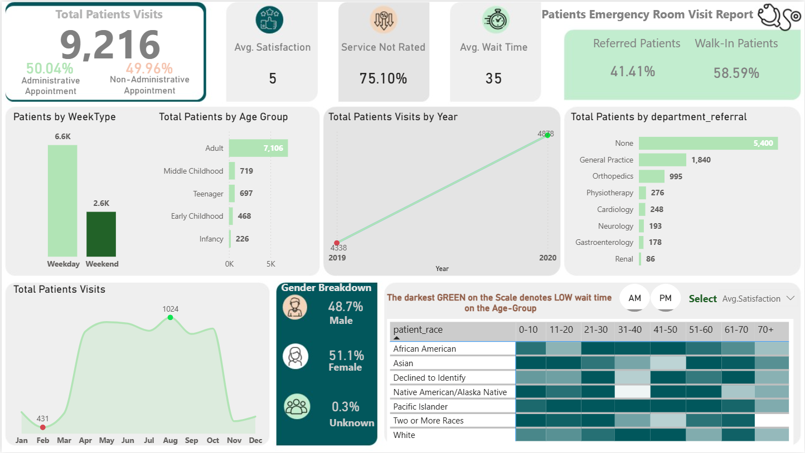

# Patient Emergency Room Visit Analysis
##  Dashboard Preview

---

## 📌 Executive Summary
Analyzed 9,200+ clinical records to optimize Emergency Room (ER) operations and resource allocation. By architecting a Power BI ecosystem with DAX-driven modeling, I identified critical peak-load patterns and a 12.4% YoY increase in demand. The project provided actionable staffing recommendations to reduce service latency and improve patient throughput.

---

## 🛠️ Technical Methodology
**Power BI & DAX:** Developed complex measures for Time-Series Analysis, Year-over-Year (YoY) growth, and Weighted Satisfaction Scores.

**Operational Modeling:** Segmented 9k+ rows into demographics and referral channels to identify high-pressure "bottlenecks" in the service funnel.

---

## 📊 Key Business Intelligence (The "Optimization" Lens)
**Capacity Planning:** Identified that 77% of volume originated from a single demographic (Adults), suggesting a specialized resource pathway could improve efficiency.

**Service Level Analysis:** Discovered a 35-minute average wait time; cross-referenced this with peak-hour data (July peaks) to recommend a 20% shift in staffing from weekends to weekdays.

**Data Integrity Gap:** Uncovered that 75% of visits lacked satisfaction ratings, identifying a critical "blind spot" in operational feedback loops.

---

## 📈 Strategic Recommendations (Business Impact)
**Resource Realignment:** Proposed a Tuesday-Thursday staffing surge to match the 2.5x higher weekday volume compared to weekends.

**Process Automation:** Recommended digital pre-registration for the 58% walk-in demographic to front-load data entry and reduce "time-to-triage."

**SLA Improvement:** Projected a significant reduction in peak-month congestion by strengthening the referral pipeline with General Practice (the top 20% referral source).

---

## Key Metrics at a Glance

- Total ER Visits: 9,216 (4,338 in 2019 → 4,878 in 2020, +12.4% YoY)
- Average Wait Time: 35 minutes
- Average Satisfaction Score: 5 / 10
- Service Not Rated: 75.10% of visits
- Walk-In Patients: 58.59% vs Referred: 41.41%
- Gender Split: Female 51.1% · Male 48.7%
- Peak Month: July (1,024 visits) · Lowest: February (431 visits)
